# Face Mask Detection

A complete end-to-end face mask detection system that detects and classifies faces into three categories: **With Mask**, **Without Mask**, and **Mask Weared Incorrect**. The project implements two detection architectures — **YOLOv26m** and **Faster R-CNN (ResNet50-FPN)** — with a Gradio-based web demo for real-time inference.

---

## Table of Contents

- [Project Overview](#project-overview)
- [Project Structure](#project-structure)
- [Dataset](#dataset)
- [Classes](#classes)
- [Prerequisites](#prerequisites)
- [Installation](#installation)
- [Pipeline Steps](#pipeline-steps)
  - [Step 1 — Download Datasets](#step-1--download-datasets)
  - [Step 2 — Explore \& Extract Labels](#step-2--explore--extract-labels)
  - [Step 3 — Preprocess \& Prepare Data](#step-3--preprocess--prepare-data)
  - [Step 4 — Train Models](#step-4--train-models)
  - [Step 5 — Evaluate \& Visualize Results](#step-5--evaluate--visualize-results)
  - [Step 6 — Run Web Demo](#step-6--run-web-demo)
- [Evaluation Results](#evaluation-results)
  - [YOLOv26m Results](#yolov26m-results)
  - [YOLOv8m Results](#yolov8m-results)
- [Technologies Used](#technologies-used)

---

## Project Overview

This project builds a face mask detection pipeline for public health monitoring. It combines two Kaggle datasets and trains two object detection models to compare performance. The final models are served through an interactive **Gradio** web application that supports both image upload and real-time webcam detection.

---

## Project Structure

```
face_mask_detection/
├── datasets/                          # Raw & processed datasets (git-ignored)
│   ├── face-mask-detection/           # Kaggle: andrewmvd/face-mask-detection
│   ├── medical-mask-detection/        # Kaggle: humansintheloop/medical-mask-detection
│   └── face-mask-detection-processed/ # YOLO-formatted output (train/val/test)
├── docs/
│   └── images/                        # Evaluation metric visualizations
├── models/                            # Trained model weights (git-ignored)
├── runs/                              # Training runs & prediction outputs (git-ignored)
├── src/
│   ├── load_datasets.py               # Step 1: Download datasets from Kaggle
│   ├── extract_label_medical_mask_detection.py  # Step 2: Explore label distribution
│   ├── preprocessing.py               # Step 3: Convert annotations & split data
│   ├── data_visualization.ipynb       # Data exploration notebook
│   ├── training_model_yolo26m.py      # Step 4a: Train YOLOv26m
│   ├── training_model_faster_cnn.py   # Step 4b: Train Faster R-CNN
│   ├── visualization_yolov26m.ipynb   # Step 5a: Visualize YOLOv26m results
│   ├── visualization_faster_rcnn.ipynb# Step 5b: Visualize Faster R-CNN results
│   └── visulization_end_to_end.ipynb  # Step 5c: End-to-end comparison
├── web_demo/
│   ├── app.py                         # Step 6: Gradio web application
│   ├── web_demo.py                    # Launcher script
│   ├── data_demo/                     # Sample images for demo
│   └── README.md                      # Web demo documentation
├── requirements.txt                   # Python dependencies
├── .gitignore
└── README.md                          # This file
```

---

## Dataset

The project merges two public Kaggle datasets:

| Dataset | Source | Format | Images |
|---------|--------|--------|--------|
| Face Mask Detection | [andrewmvd/face-mask-detection](https://www.kaggle.com/datasets/andrewmvd/face-mask-detection) | XML (Pascal VOC) | ~853 |
| Medical Mask Detection | [humansintheloop/medical-mask-detection](https://www.kaggle.com/datasets/humansintheloop/medical-mask-detection) | JSON | ~6,000 |

After preprocessing, the combined dataset is split as follows:

| Split | Ratio |
|-------|-------|
| Training | 70% |
| Validation | 20% |
| Test | 10% |

---

## Classes

| Class ID | Label | Description |
|----------|-------|-------------|
| 0 | With Mask | Face properly covered by mask |
| 1 | Without Mask | Face with no mask |
| 2 | Mask Weared Incorrect | Mask worn but not properly covering nose/mouth |

---

## Prerequisites

- **Python** 3.10+
- **pip** (package manager)
- **Kaggle account** (for dataset download via `kagglehub`)
- **GPU** (recommended): NVIDIA CUDA GPU or Apple Silicon (MPS) for faster training

---

## Installation

1. **Clone the repository**

   ```bash
   git clone https://github.com/<your-username>/face_mask_detection.git
   cd face_mask_detection
   ```

2. **Create and activate a virtual environment**

   ```bash
   python -m venv .venv
   source .venv/bin/activate        # macOS / Linux
   # .venv\Scripts\activate          # Windows
   ```

3. **Install dependencies**

   ```bash
   pip install -r requirements.txt
   ```

---

## Pipeline Steps

### Step 1 — Download Datasets

Download both face mask datasets from Kaggle using `kagglehub`:

```bash
python src/load_datasets.py
```

This downloads and moves the datasets into the `datasets/` directory:
- `datasets/face-mask-detection/` — XML annotations + images
- `datasets/medical-mask-detection/` — JSON annotations + images

> **Note:** Ensure your Kaggle API credentials are configured. See [Kaggle API docs](https://www.kaggle.com/docs/api) for setup.

---

### Step 2 — Explore & Extract Labels

Inspect the label distribution and class names in the medical mask dataset:

```bash
python src/extract_label_medical_mask_detection.py
```

This prints all unique class names, annotation counts, and sample images for each class. You can also explore the data interactively:

```bash
jupyter notebook src/data_visualization.ipynb
```

---

### Step 3 — Preprocess & Prepare Data

Convert all annotations (XML + JSON) to **YOLO format** and split into train/val/test:

```bash
python src/preprocessing.py
```

This script performs:
1. Creates the YOLO directory structure under `datasets/face-mask-detection-processed/`
2. Parses XML annotations (face-mask-detection) → YOLO format
3. Parses JSON annotations (medical-mask-detection) → YOLO format with class mapping
4. Splits data into train (70%), validation (20%), and test (10%)
5. Copies images and generates label `.txt` files
6. Creates `dataset.yaml` for YOLO training

---

### Step 4 — Train Models

#### 4a. Train YOLOv26m

```bash
python src/training_model_yolo26m.py
```

Key training configuration:
- **Model:** YOLOv26m (pretrained)
- **Epochs:** 100 (with early stopping, patience=15)
- **Image Size:** 192×192
- **Optimizer:** SGD (lr=0.01, momentum=0.937)
- **Augmentation:** Mosaic, flip, rotation, scale
- **FP16:** Enabled on GPU (CUDA / Apple MPS)

The script automatically detects your hardware (NVIDIA CUDA, Apple Metal, or CPU) and adjusts batch size accordingly.

Outputs are saved to `runs/face_mask_detection_yolo26m_v1/`.

#### 4b. Train Faster R-CNN

```bash
python src/training_model_faster_cnn.py
```

Key training configuration:
- **Model:** Faster R-CNN with ResNet50-FPN backbone (pretrained on COCO)
- **Epochs:** 6 (fast mode) or 15 (full mode)
- **Optimizer:** SGD (lr=0.002, momentum=0.9)
- **Backbone:** Frozen except `layer4` for faster convergence
- **Scheduler:** StepLR (step=5, gamma=0.1)

Model checkpoints are saved to `models/`.

---

### Step 5 — Evaluate & Visualize Results

Run the visualization notebooks to analyze training results:

```bash
# YOLOv26m evaluation
jupyter notebook src/visualization_yolov26m.ipynb

# Faster R-CNN evaluation
jupyter notebook src/visualization_faster_rcnn.ipynb

# End-to-end comparison
jupyter notebook src/visulization_end_to_end.ipynb
```

See the [Evaluation Results](#evaluation-results) section below for detailed metrics and charts.

---

### Step 6 — Run Web Demo

Launch the Gradio web application for interactive inference:

```bash
python web_demo/app.py
```

The app starts at **http://127.0.0.1:7860** and provides:

- **Image mode** — Upload or paste an image for detailed detection with a results table
- **Realtime mode** — Stream webcam feed for live face mask detection
- **Model selection** — Switch between YOLOv26m and Faster R-CNN checkpoints
- **Adjustable thresholds** — Tune confidence and IoU thresholds via sliders

Optional environment variables:

| Variable | Default | Description |
|----------|---------|-------------|
| `WEB_DEMO_HOST` | `127.0.0.1` | Server bind address |
| `WEB_DEMO_PORT` | `7860` | Server port |
| `WEB_DEMO_OPEN_BROWSER` | `false` | Auto-open browser on launch |
| `WEB_DEMO_SHARE` | `false` | Create a public Gradio share link |
| `WEB_DEMO_NATIVE_WEBCAM` | `false` | Use OpenCV native webcam instead of Gradio |

---

## Evaluation Results

### Model Accuracy Comparison

The following table summarizes the **end-to-end** accuracy results of both models evaluated on the **test set** (578 images, 1393 ground-truth faces). Metrics are computed on IoU-matched detections via the notebook `src/visulization_end_to_end.ipynb`.

#### Detection Metrics

| Model | Det Precision | Det Recall | Det F1 | TP | FP | FN |
|-------|---------------|------------|--------|-----|-----|-----|
| **YOLOv26m** | 0.8804 | 0.6825 | 0.7689 | 950 | 129 | 442 |
| **Faster R-CNN** | 0.7901 | 0.8872 | 0.8359 | 1235 | 328 | 157 |

#### Classification Metrics (on matched detections)

| Model | Accuracy | Precision (W) | Recall (W) | F1 (W) | Precision (Macro) | Recall (Macro) | F1 (Macro) | mAP | Avg IoU |
|-------|----------|---------------|------------|--------|-------------------|----------------|------------|------|---------|
| **YOLOv26m** | **97.47%** | 97.05% | 97.47% | 97.15% | 86.00% | 76.87% | 80.03% | 0.7426 | 0.8075 |
| **Faster R-CNN** | **95.95%** | 95.15% | 95.95% | 94.75% | 85.52% | 67.23% | 67.68% | 0.6776 | 0.7894 |

#### YOLOv26m — Per-Class Results (matched detections)

| Class | Precision | Recall | F1-Score | Support |
|-------|-----------|--------|----------|---------|
| With Mask | 0.98 | 0.99 | 0.99 | 783 |
| Without Mask | 0.99 | 0.98 | 0.98 | 143 |
| Mask Weared Incorrect | 0.62 | 0.33 | 0.43 | 24 |
| **Weighted Avg** | **0.97** | **0.97** | **0.97** | **950** |

#### Faster R-CNN — Per-Class Results (matched detections)

| Class | Precision | Recall | F1-Score | Support |
|-------|-----------|--------|----------|---------|
| With Mask | 0.97 | 0.99 | 0.98 | 984 |
| Without Mask | 0.93 | 0.97 | 0.95 | 214 |
| Mask Weared Incorrect | 0.67 | 0.05 | 0.10 | 37 |
| **Weighted Avg** | **0.95** | **0.96** | **0.95** | **1235** |

> **Key takeaway:** YOLOv26m achieves higher classification accuracy on matched detections (97.47% vs 95.95%), while Faster R-CNN has a higher detection recall (88.72% vs 68.25%), meaning it misses fewer faces. Both models struggle significantly with the "Mask Weared Incorrect" class due to its very low sample count.

---

### YOLOv26m Results

#### Training Curves

The following chart shows loss curves and evaluation metrics across 80 training epochs:

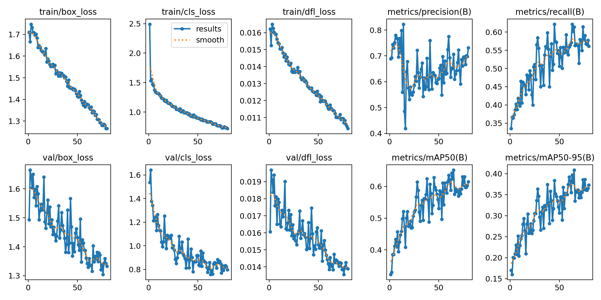

#### Best Training Epoch Metrics (Epoch 65)

| Metric | Value |
|--------|-------|
| **Precision** | 0.706 |
| **Recall** | 0.614 |
| **mAP@50** | 0.652 |
| **mAP@50-95** | 0.409 |

#### Test Set Overall Accuracy

| Metric | Value |
|--------|-------|
| **Accuracy** | 96.20% |
| **Precision (weighted)** | 95.61% |
| **Recall (weighted)** | 96.20% |
| **F1-Score (weighted)** | 95.83% |
| **Detection Rate** | 79.33% |
| **Average IoU (matched)** | 0.7977 |

#### Confusion Matrix

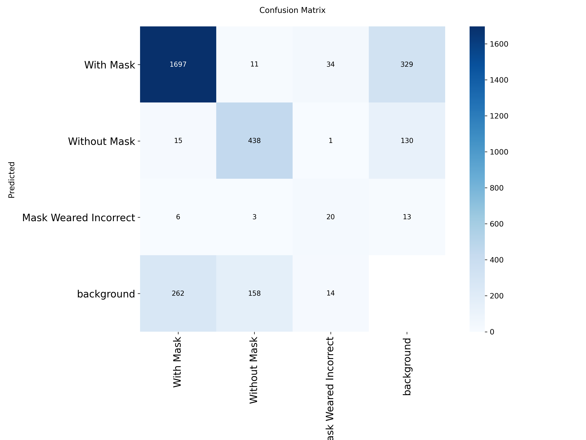

#### Normalized Confusion Matrix

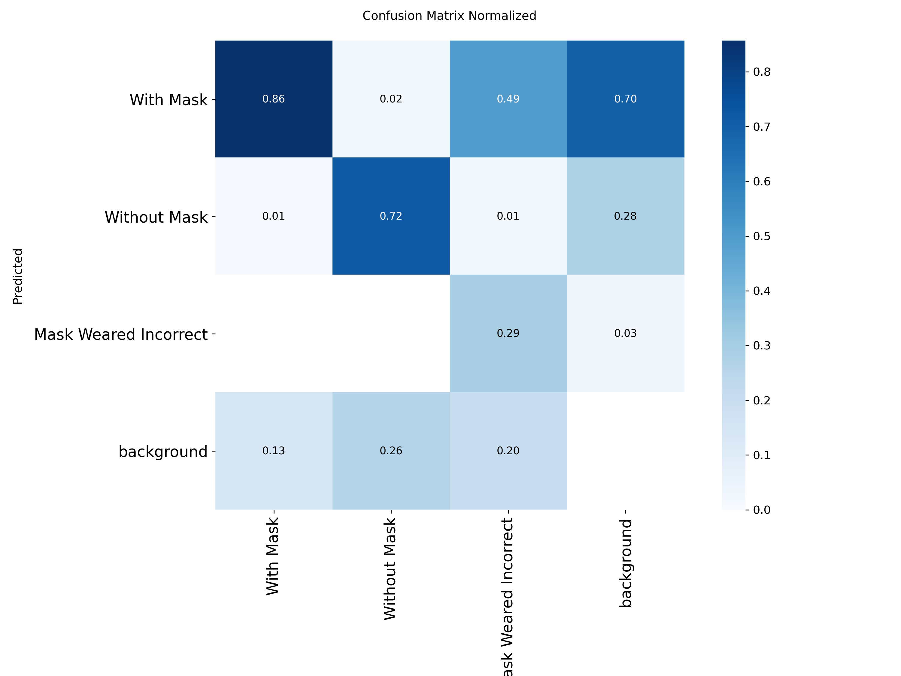

#### Precision-Recall Curve

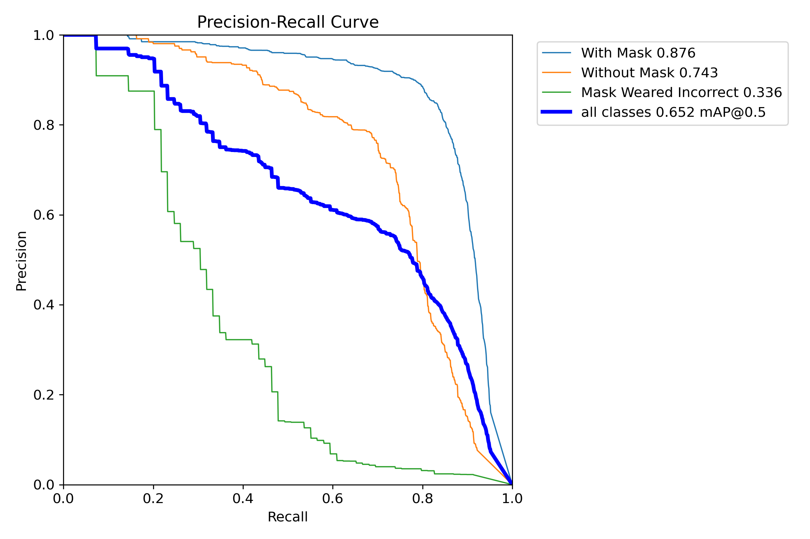

#### F1-Confidence Curve

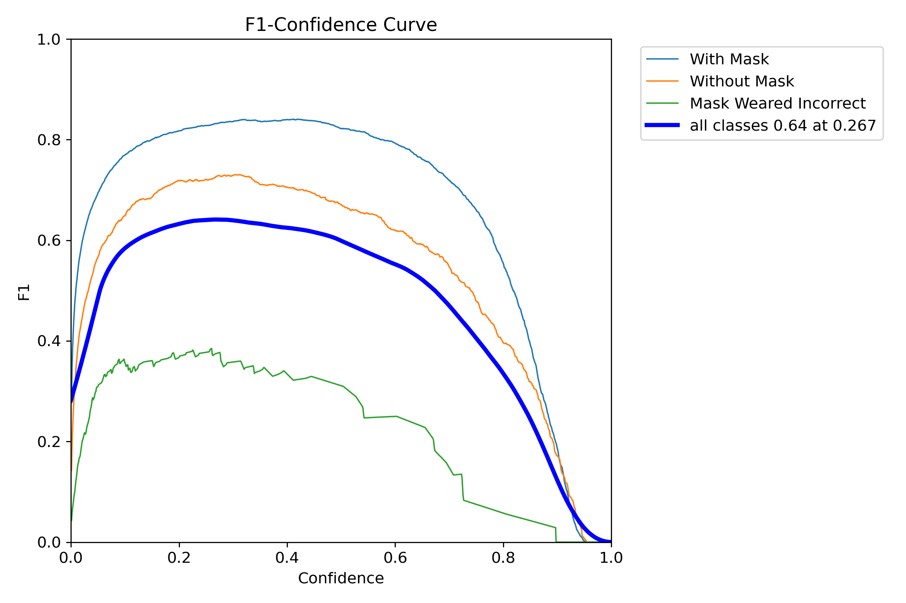

#### Precision-Confidence Curve

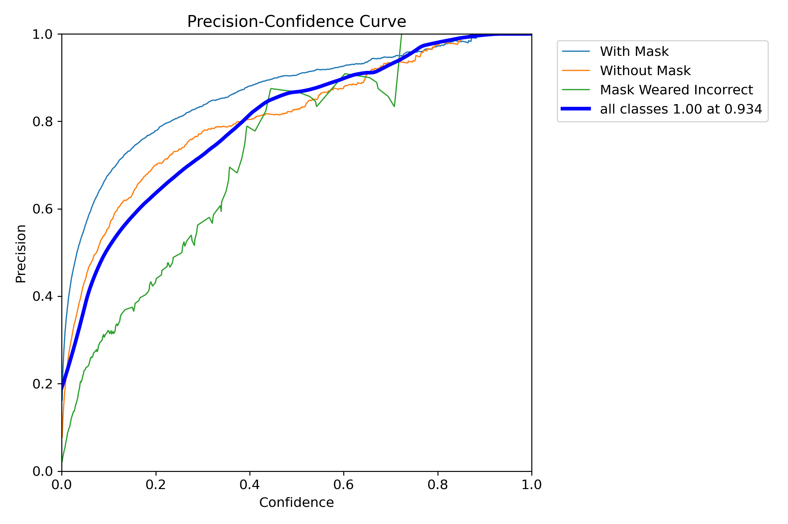

#### Recall-Confidence Curve

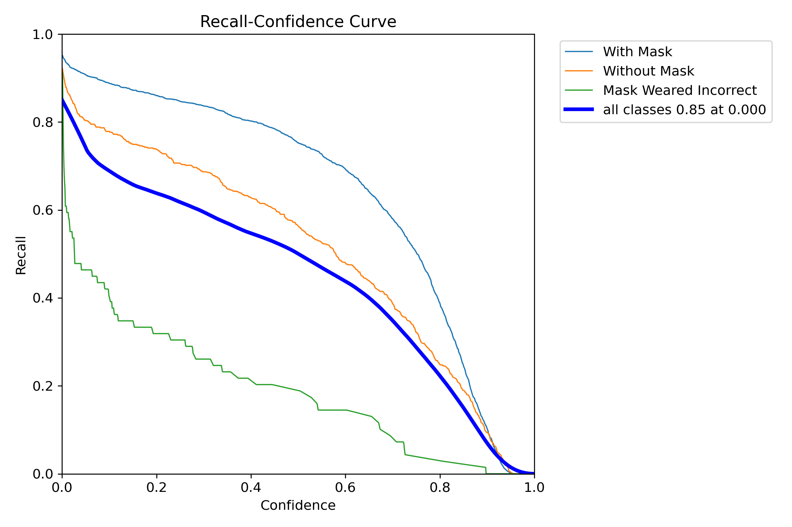

#### Label Distribution

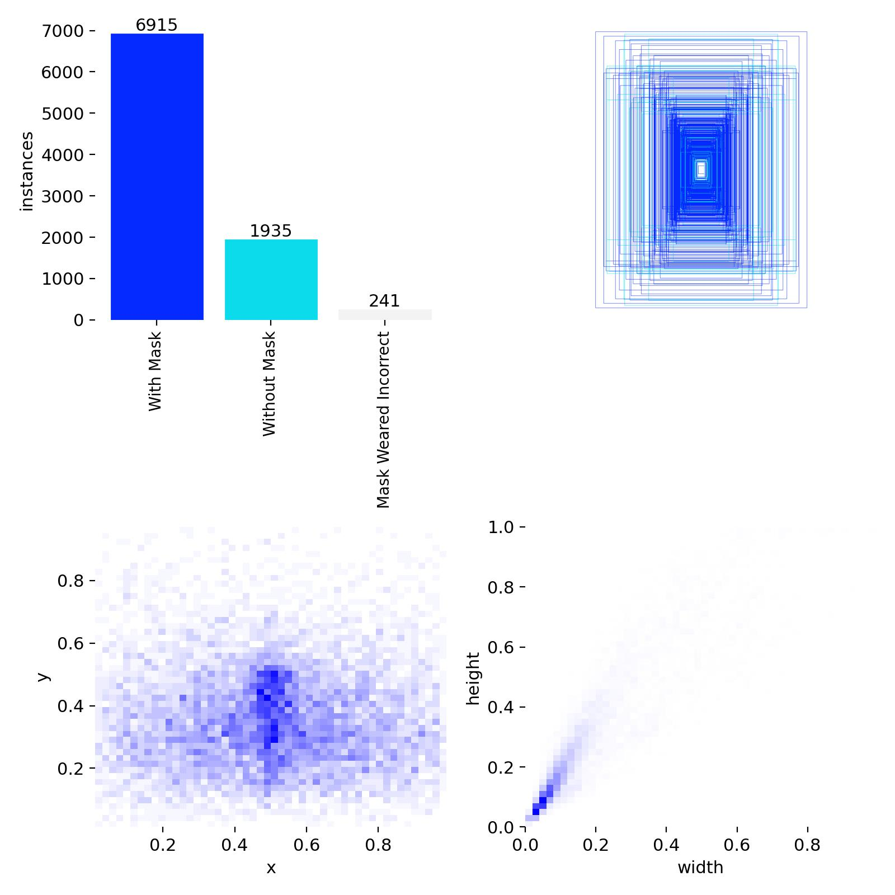

#### Sample Validation Predictions

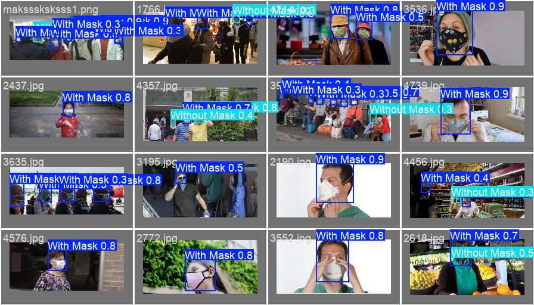

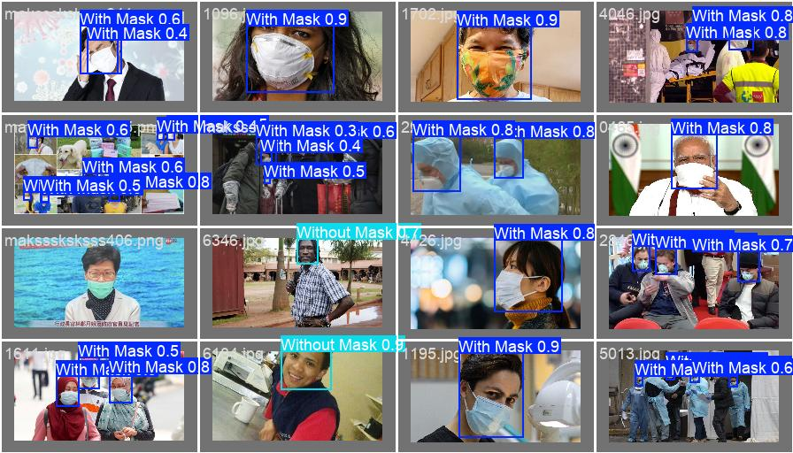

---

### YOLOv8m Results

#### Training Curves

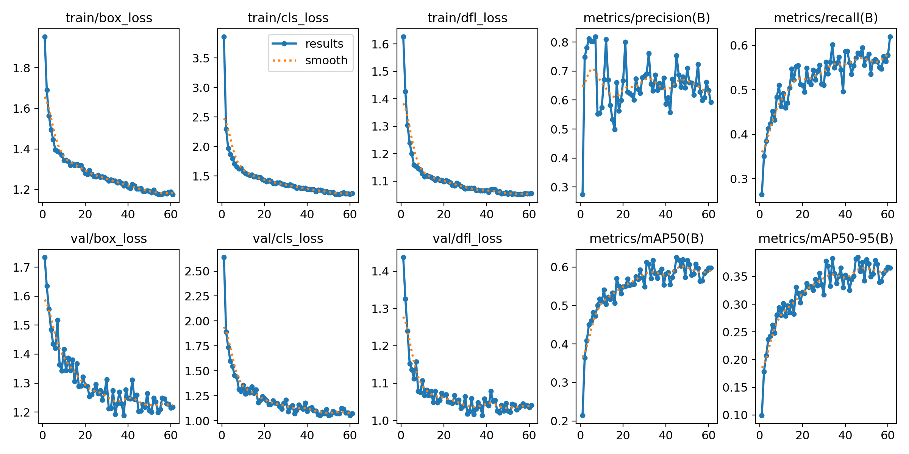

#### Confusion Matrix

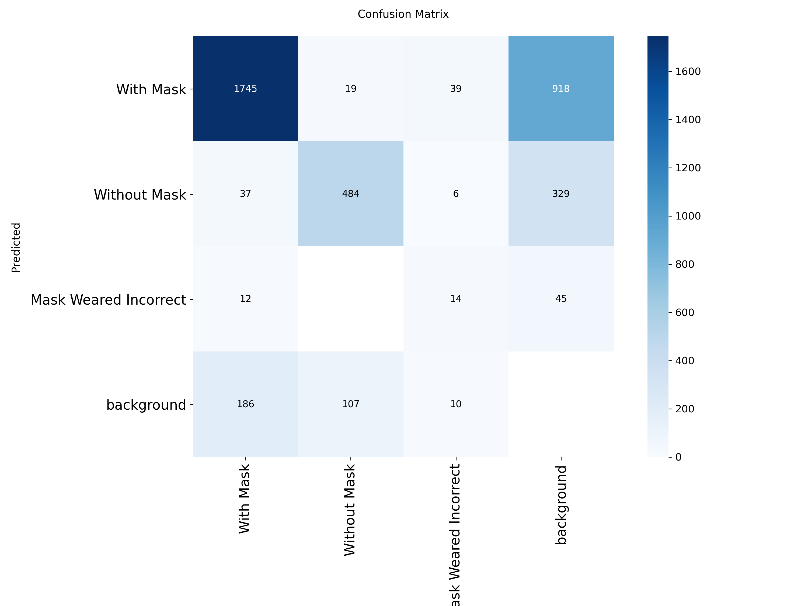

#### Normalized Confusion Matrix

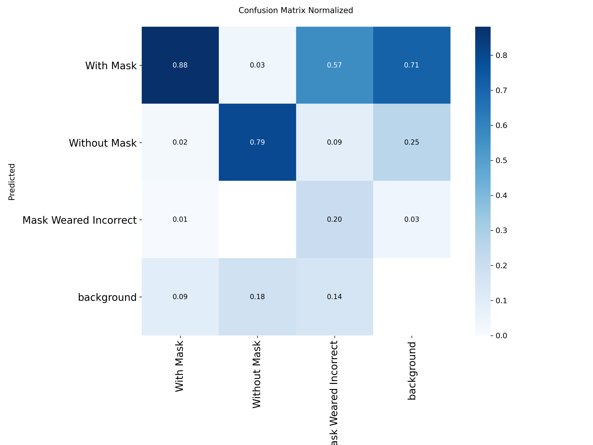

#### Precision-Recall Curve

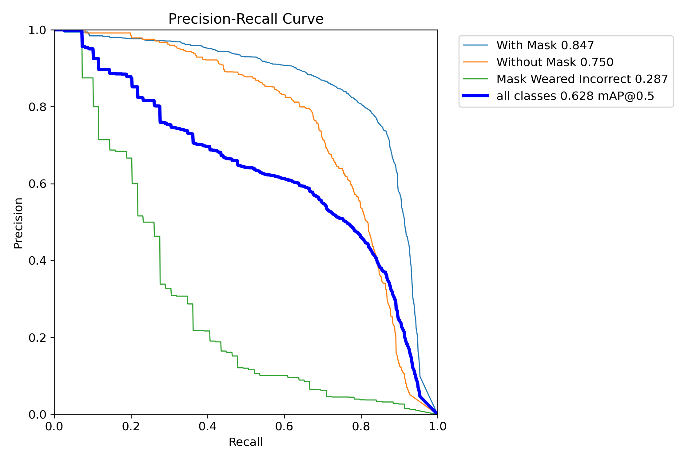

#### F1-Confidence Curve

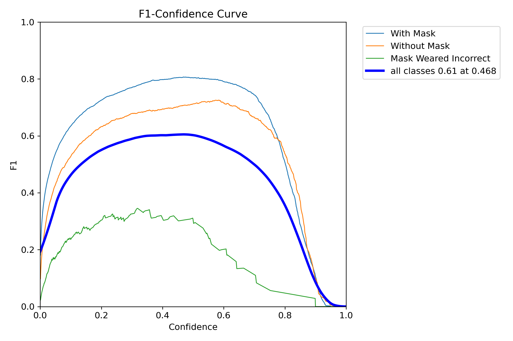

#### Sample Validation Predictions

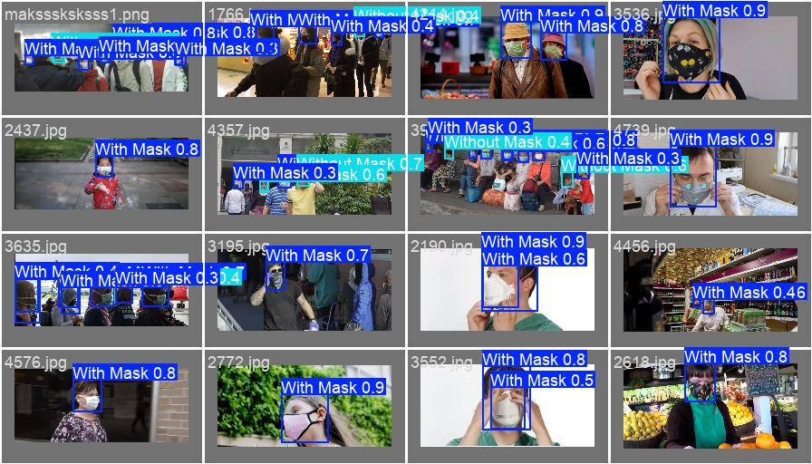

---

## Technologies Used

| Category | Technology |
|----------|------------|
| Language | Python 3.10+ |
| Object Detection | Ultralytics YOLO, Faster R-CNN (torchvision) |
| Deep Learning | PyTorch, TensorFlow/Keras |
| Data Processing | OpenCV, Pillow, NumPy, Pandas, scikit-learn |
| Visualization | Matplotlib, Seaborn, Jupyter Notebook |
| Web Demo | Gradio |
| Dataset Source | Kaggle (via kagglehub) |
| Model Export | ONNX, TorchScript, TFLite |
